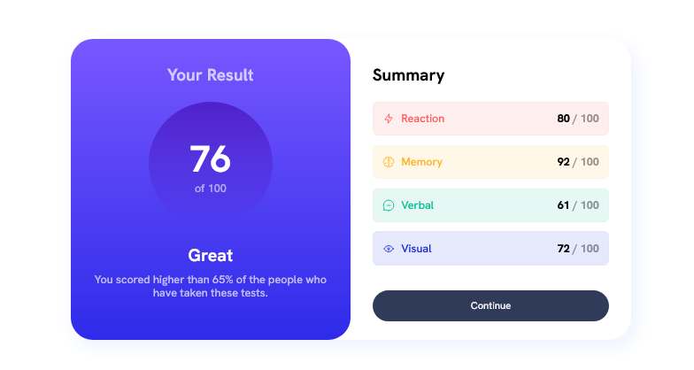

# Frontend Mentor - Results summary component solution

This is a solution to the [Results summary component challenge on Frontend Mentor](https://www.frontendmentor.io/challenges/results-summary-component-CE_K6s0maV).

## Overview

### Screenshot



### Links

- Live Site URL: [Vercel](https://results-summary-component-main-indol.vercel.app)

## My process

### Built with

- Semantic HTML5 markup
- SCSS custom properties
- Flexbox
- Mobile-first workflow

### What I learned

I learned how to make a beautiful transition on mouse hover from a monotone color to a gradient:

```html
<button class="result_right_button">Continue</button>
```
```scss
.result_right_button {
    position: relative;
    @include btnGradientTransition($bgColor: var(--dark-gray-blue));
    z-index: 2;

    &::before {
      content: "Continue";
      position: absolute;
      left: 0;
      top: 0;
      @include btnGradientTransition($bgColor: linear-gradient(var(--light-slate-blue-bg), var(--light-royal-blue-bg)));
      opacity: 0;
      z-index: 1;
      transition: opacity 0.3s linear;
    }

    &:hover::before {
      opacity: 1;
    }
  }
```
